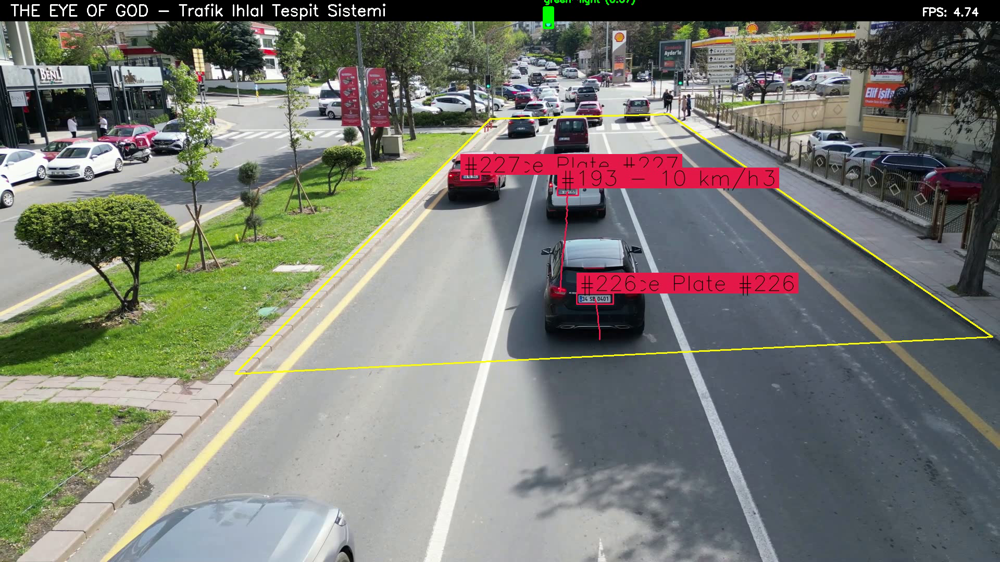
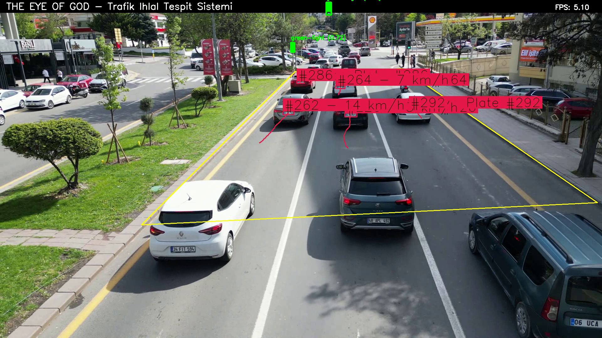
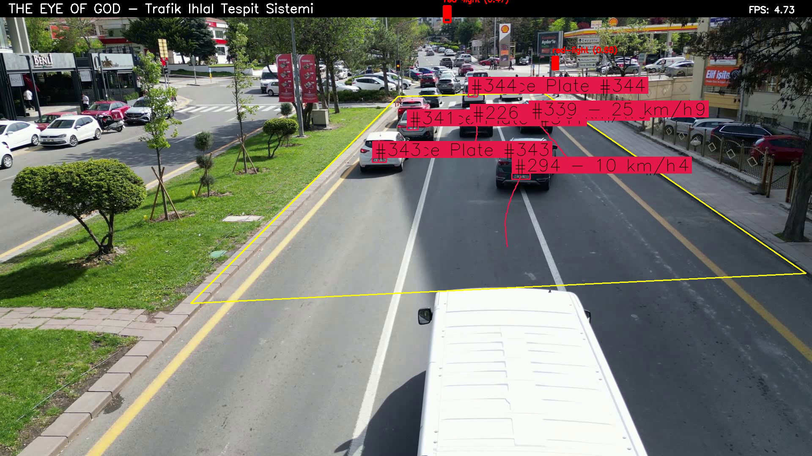
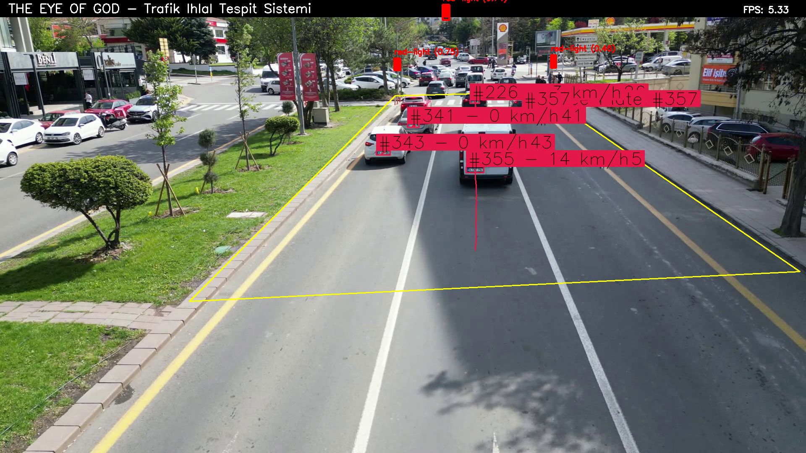

# The Eye of God - Traffic Violation Detection System

An AI-powered, real-time traffic violation detection and archiving system.

## Features

- **Traffic Light Violation Detection**: Detects vehicles running red or yellow lights.
- **Speeding Violation Detection**: Measures vehicle speeds using matrix transformation and records limit violations.
- **License Plate Recognition**: Reads Turkish license plates with high accuracy using Tesseract OCR.
- **Detailed Archiving**: Creates an evidence image and detailed information record for each violation.
- **Database Tracking**: Stores all vehicle and violation information in an SQLite database.
- **Real-time Visualization**: Displays detection, tracking, and measurement information on the live video feed.

## Screenshots

Here are some screenshots demonstrating the system in action. Please note that you need to generate these images yourself.

1.  Capture 5 screenshots from the `show/app-output/app-output-main.mp4` video.
2.  Save them in the `show/screenshots/` directory with names like `screenshot_1.png`, `screenshot_2.png`, etc.

Once you've done that, the images will appear here.










## System Requirements

- Python 3.8-3.10 (3.10 recommended)
- NVIDIA GPU with CUDA support (recommended)
- Tesseract OCR (Windows Path: C:\Program Files\Tesseract-OCR)
- Sufficient RAM (at least 8GB, 16GB recommended)

## Installation

### 1. Environment Setup

Create a virtual environment (optional but recommended):
```bash
# Windows
python -m venv .venv
.venv\Scripts\activate

# Linux/macOS
python -m venv .venv
source .venv/bin/activate
```

### 2. Install Dependencies

```bash
pip install -r requirements.txt
```

### 3. Check YOLOv8 Models

Ensure the following files are present in the `models/` directory:
- `yolov8x.pt` (for vehicle detection)
- `yolov8y.pt` (for traffic light and license plate detection)

You can download missing models from the [Ultralytics YOLOv8](https://github.com/ultralytics/ultralytics) website.

### 4. Tesseract OCR Installation

- **Windows**: Download and install from [Tesseract OCR for Windows](https://github.com/UB-Mannheim/tesseract/wiki)
- **Linux**: `sudo apt install tesseract-ocr`
- **macOS**: `brew install tesseract`

### 5. Potential Issues and Solutions

#### YOLOv8 Model Loading Issues

The program attempts to load models automatically using several methods:
1. Direct loading with `ultralytics.YOLO`
2. Alternative path with `ultralytics.models.YOLO`
3. `torch.hub.load` method
4. Uses mock models if all else fails

If the models still fail to load:

```bash
# Reinstall the Ultralytics package
pip uninstall ultralytics
pip install ultralytics==8.0.225

# Reinstall Torch and torchvision (for CUDA 11.8)
pip uninstall torch torchvision
pip install torch==2.0.1 torchvision==0.15.2 --index-url https://download.pytorch.org/whl/cu118
```

## Running the System

```bash
python main.py
```

## Project Structure

```
the_eye_of_god-v1.1/
├── models/                # YOLOv8 models
├── video-data/            # Test and main video files
├── outputs/               # Violation records and log files
├── database/              # SQLite database
├── utils/                 # Helper functions
├── show/screenshots/      # Screenshots for README
├── main.py                # Main program
├── README.md              # This file
├── PRD.md                 # Product Requirements Document
├── LICENSE                # MIT License
└── requirements.txt       # Required packages
```

## Calibrations

Matrix coordinates:
- `[856, 247], [1179, 245], [1917, 820], [288, 841]`

Traffic light violation line:
- The virtual line between `[856, 247]` and `[1179, 245]`

## Sample Video

The sample video file used in this project, `app-output-main.mp4`, is located in the `show/app-output/` directory. It is used to demonstrate the system's traffic violation detection capabilities.

## License

This project is licensed under the MIT License - see the [LICENSE](LICENSE) file for details. 